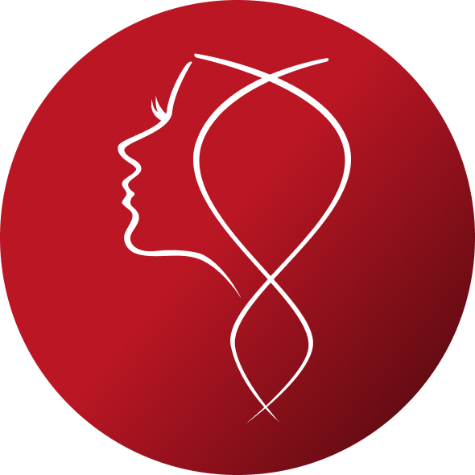

<p align="center">
  
</p>

<h1 align="center">Saraya Clone</h1>
<p align="center">Mobile learning & finance onboarding app built with Expo Router.</p>

<p align="center">
  
  
  
  
  
</p>

## Overview
Saraya Clone adalah aplikasi onboarding edukasi finansial untuk UMKM dengan alur:

`Get Started -> Sign In / Sign Up -> Welcome -> Survey 1-5 -> Congratulations -> Explore`

Fokus project:
- UI flow onboarding end-to-end
- Routing berbasis file dengan `expo-router`
- Komponen reusable + tema dasar

## Main Screens
- `get-started` : landing awal
- `sign-in` / `sign-up` : autentikasi UI
- `welcome` : intro personal
- `survey-1` s/d `survey-5` : pengumpulan preferensi user
- `congratulations` : halaman sukses + CTA belajar
- `(tabs)/explore` : halaman konten/eksplorasi

## Project Structure
```text
app/
  (tabs)/
  _layout.tsx
  get-started.tsx
  sign-in.tsx
  sign-up.tsx
  survey-1.tsx
  survey-2.tsx
  survey-3.tsx
  survey-4.tsx
  survey-5.tsx
  congratulations.tsx
  welcome.tsx
assets/
  images/
components/
constants/
hooks/
```

## Getting Started
1. Install dependencies
```bash
npm install
```

2. Run development server
```bash
npm run start
```

3. Run specific platform
```bash
npm run android
npm run ios
npm run web
```

## Available Scripts
```bash
npm run start
npm run android
npm run ios
npm run web
npm run lint
```

## Tech Stack
- Expo SDK 54
- React Native + React 19
- Expo Router
- TypeScript (strict mode)
- ESLint (Expo config)

## Notes
- Semua asset utama disimpan di `assets/images`.
- Beberapa ilustrasi survey ada di `assets/images/img-survey4`.
- Project ini masih fokus di UI/flow; integrasi backend auth/data bisa ditambah berikutnya.
